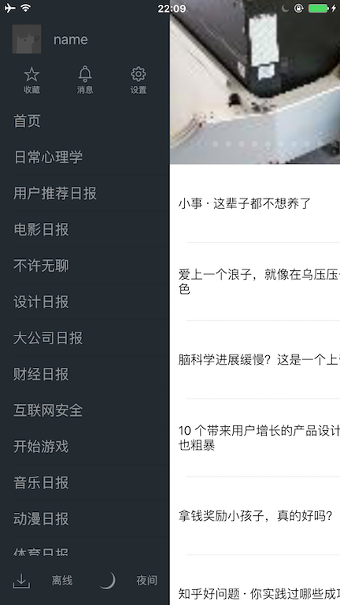
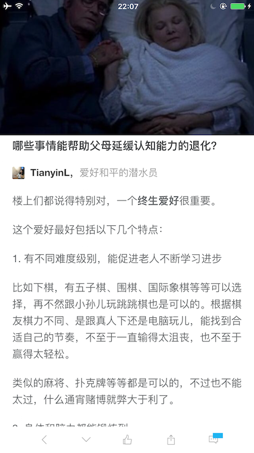

# swift版知乎日报

### 已实现的功能
* 首页左滑菜单界面
* 文章详情界面
* 文章详情界面上下切换的动画
* 主题文章界面

### 等待实现的功能
* 文章后台缓存功能
* 首页海报获取更新
* 滑动菜单界面的优化
* 各种bugs
* ...

### 截图:






### 项目结构:
```
├── AppDelegate.swift
├── BCComponents
│   ├── Article
│   │   ├── View
│   │   │   ├── WLYArticleDetailCell.swift
│   │   │   ├── WLYArticleDetailRefreshView.swift
│   │   │   ├── WLYArticleDetailToolBarView.swift
│   │   │   ├── WLYArticleNavigationBar.swift
│   │   │   └── WLYArticleTableViewCell.swift
│   │   ├── WLYArticleChannelViewController.swift
│   │   ├── WLYArticleDetailCollectionViewController.swift
│   │   └── WLYArticleListViewController.swift
│   └── Home
│       ├── View
│       │   ├── HomeSideMenuFooterView.swift
│       │   └── HomeSideMenuHeaderView.swift
│       └── WLYHomeMenuViewController.swift
├── Library
│   ├── ArticleHTMLParser.swift
│   ├── UIKit
│   │   ├── UIColor+WLYCommon.swift
│   │   ├── UIColor+WLYExtension.swift
│   │   ├── UIScrollView+WLYPanGestureAllowEventPass.swift
│   │   └── UIView+WLYExtension.swift
│   ├── URLArrayTransform.swift
│   ├── Vendors
│   └── WLYLog.swift
├── Models
│   ├── WLYArticle.swift
│   ├── WLYArticleDetail.swift
│   ├── WLYArticleTheme.swift
│   ├── WLYArticleThemeResult.swift
│   ├── WLYDailyArticle.swift
│   ├── WLYEditor.swift
│   └── WLYThemeArticles.swift
├── Services
│   ├── ArticleService.swift
│   ├── BaseServiceAPI.swift
│   └── WLYArticleCacheService.swift
├── ViewControllers
│   ├── WLYSideMenuViewController.swift
│   ├── WLYTableViewController.swift
│   └── WLYViewController.swift
└── Views
    ├── UIScrollView+WLYPullToRefresh.swift
    ├── WLYHorizontalLayoutButton.swift
    ├── WLYPullToRefreshView.swift
    ├── WLYRefreshLoadingView.swift
    ├── WLYScrollImageView.swift
    ├── WLYTableViewCell.swift
    └── WLYVerticalLayoutButton.swift
```

### 如何使用
* 下载源码
```
git clone https://github.com/huaf22/zhihuSwiftDemo.git
```
* 使用 pod 安装依赖
```
pod install
```
* 使用 Xcode 打开 zhihuSwiftDemo.xcworkspace 

### 知乎日报 API 
[izzyleung/ZhihuDailyPurify](https://github.com/izzyleung/ZhihuDailyPurify/wiki/%E7%9F%A5%E4%B9%8E%E6%97%A5%E6%8A%A5-API-%E5%88%86%E6%9E%90)

### 使用的开源库
* [SnapKit](https://github.com/SnapKit/SnapKit)
* [Kingfisher](https://github.com/onevcat/Kingfisher)
* [Alamofire](https://github.com/Alamofire/Alamofire)
* [AlamofireObjectMapper](https://github.com/tristanhimmelman/AlamofireObjectMapper)
* [XCGLogger](https://github.com/DaveWoodCom/XCGLogger)
 
 
Thanks to all of you